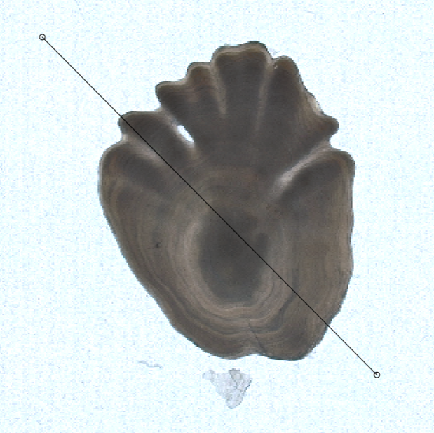
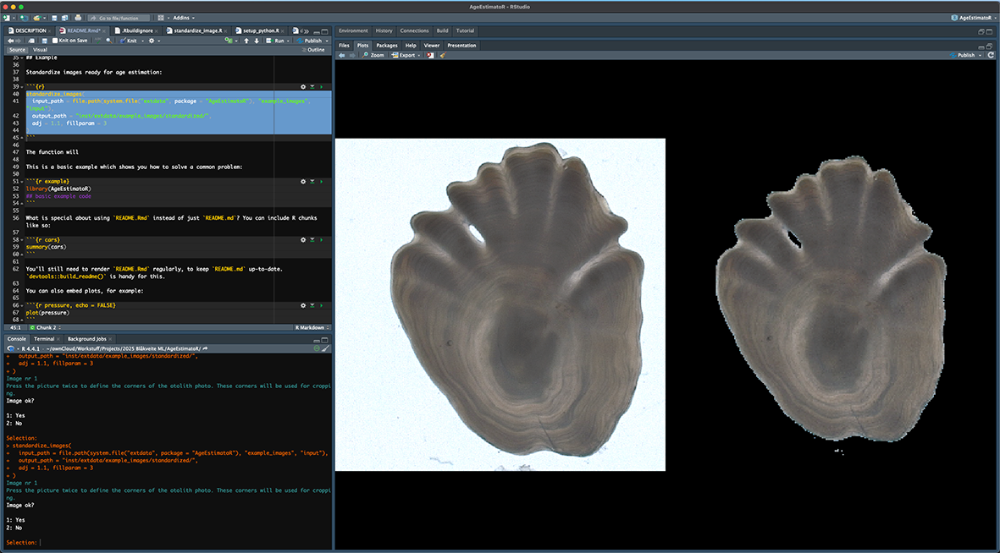

<!-- README.md is generated from README.Rmd. Please edit that file -->

```{r, include = FALSE}
knitr::opts_chunk$set(
  collapse = TRUE,
  comment = "#>",
  fig.path = "man/figures/README-",
  out.width = "100%"
)
```

# AgeEstimatoR
**Estimate age from otolith pictures using Deep Learning. R package version `r packageVersion("AgeEstimatoR")`**
<!-- badges: start -->
<!-- badges: end -->

This is an early draft of an R package to standardize fish otolith photographs and use 
Deep Learning (DL or ML) models to estimate the age from the standardized photographs. 
The package currently works only for Greenland halibut and uses the models 
developed by [Martinsen et al. (2022)](https://doi.org/10.1371/journal.pone.0277244) but 
may be extended for other species and models in the future. The age estimation
uses Python and the TensorFlow platform for machine learning. Note that the DL age
estimation method was developed only for **right otoliths of Greenland halibut**.  

Running the age estimation function (`estimate_age`) downloads Python and TensorFlow into a virtual environment (`~/AgeEstimatoR large files/python_virtualenv` by default) together with DL models for Greenland halibut (`~/AgeEstimatoR large files/dl_models`). These **take >2.2 gigabytes of file space** in total.

## Installation

You can install AgeEstimatoR using the remotes or devtools packages:

``` {r, eval = FALSE}
remotes::install_github("DeepWaterIMR/AgeEstimatoR")
```

## Usage

Load the package into the workspace:

```{r}
library(AgeEstimatoR)
```

### Image standardization

Standardize images ready for age estimation:

```{r, eval = FALSE}
standardize_images(
  input_path = file.path(system.file("extdata", package = "AgeEstimatoR"), 
                         "example_images", "input"),
  output_path = "inst/extdata/example_images/standardized/",
  adj = 1.1, fillparam = 3
)
```

The `adj` parameter defines the adjustment parameter for intensity threshold (see `adjust` in [imager::threshold](https://rdrr.io/cran/imager/man/threshold.html)) and the `fillparam` the amount of fill in holes using morphological closing (see [imager::fill](https://rdrr.io/cran/imager/man/clean.html)). The function brings up a plot screen where you'll need to mark the corners of the **right** otolith for cropping. 

```{r, echo = FALSE}
knitr::include_graphics("man/figures/interface.png")
```

To do the marking, click the photograph twice until you see a line:

```{r, echo = FALSE, out.width="50%"}

```

Next, the resulting cropped photo will be displayed (left without filtering, right with filtering). You will now be asked whether you are satisfied with the result on the right. If you answer 2 (no), the function will ask new adjustment and fill parameters and you will get a new shot at cropping the photo. If you answer 1 (yes), the function will jump to the next photo.

```{r, echo = FALSE}

```

The automatic query of the adjustment and fill parameters can be turned off using the `ask` argument in `standardize_images()`.

### Age estimation

It is important to understand how the `estimate_age()` function **can clutter your computer full of Python installations if used wrong**: The age estimation requires Python 3.11, TensorFlow and very specific versions of Python modules. Consequently, when used for the first time, the `estimate_age()` function downloads complete Python 3.11, TensorFlow and required modules into a virtual environment folder `~/AgeEstimatoR large files/python_virtualenv` by default. The folder takes 1.43 GB of file space. Hence it is adviced not to change the `venv_path` argument unless you plan to do so in every project you are using the age estimation. The function also downloads the deep learning models required for Greenland halibut age estimation and places them in `~/AgeEstimatoR large files/dl_models` by default. 

<!-- Currently there is unresolved issue in setting up the python environment within the `estimate_age()` function. **The first time** you setup the environment, do so using the `setup_python` function explicitly: -->

<!-- ```{r, eval = FALSE} -->
<!-- setup_python(venv_path) -->
<!-- ``` -->

<!-- When that is done once, refer to the environment when using the `estimate_age()` function. You can also move the `python_virtualenvironment` into a more convinient place on your computer if you wish so.  -->

Once the requirements are set up, we can do the age estimation:

```{r, eval = FALSE}
x <- estimate_age(
  image_path = 
    system.file("extdata", "example_images", "standardized", package = "AgeEstimatoR")
  )
```

The function returns the estimated ages into an object `x` in the example above. Use the `output_path` argument to save the results directly into a file. The results can then be plotted by sex:

```{r, echo = FALSE}
x <- readr::read_csv(system.file("extdata", "ml_age_estimates.csv", package = "AgeEstimatoR"),
                     show_col_types = FALSE)
```

```{r, fig.cap="Figure: distribution of age estimates for right otoliths of Greenland halibut from 10 deep learning models for females, males and unknowon sex (average between females and males). Vertical lines indicate mean values; colored lines for each sex and black line for all estimates.", message=FALSE}
library(ggplot2); library(dplyr); library(tidyr)

tmp <- x %>% 
  tidyr::pivot_longer(c("male", "female", "unknown")) %>% 
  mutate(imageid = factor(imageid),
         model = factor(model)) 

tmp %>% 
  ggplot(aes(x = value, fill = name)) +
  geom_histogram(binwidth = 0.5, alpha = 0.7) +
  geom_vline(
    data = tmp %>% 
      group_by(imageid, name) %>% 
      reframe(mean = mean(value)),
    aes(xintercept = mean, color = name)
  ) +
  geom_vline(
    data = tmp %>% 
      group_by(imageid) %>% 
      reframe(mean = mean(value)),
    aes(xintercept = mean), color = "black"
  ) +
  scale_y_continuous(expand = expansion(mult = c(0,0.05))) +
  facet_wrap(~imageid) +
  labs(x = "Age", y = "Number of model estimates", fill = "Sex",
       color = "Sex") +
  theme_bw()
```

Or by model:

```{r, fig.cap="Figure: distribution of age estimates for right otoliths of Greenland halibut from 10 deep learning models. Crossbar boxes insidate average and standard deviation for each model (colors) or all estimates (grey) ", message=FALSE}

tmp %>% 
  ggplot(aes(x = imageid, y = value, color = model)) +
  geom_crossbar(
    data = tmp %>% 
      group_by(imageid) %>% 
      reframe(mean = mean(value), sd = sd(value)),
    aes(y = mean, ymin = mean - sd, ymax = mean + sd),
    color = "grey",
  ) +
  geom_jitter() +
  labs(y = "Age", x = "Image ID", fill = "Model",
       color = "Model") +
  scale_y_continuous(n.breaks = 10) +
  geom_crossbar(
    data = tmp %>% 
      group_by(imageid, model) %>% 
      reframe(mean = mean(value), sd = sd(value)),
    aes(y = mean, ymin = mean - sd, ymax = mean + sd),
    width = 0.1, position = position_jitter(width = 0.2)
  ) +
  theme_minimal()
```

#### Age estimation using Python

The age estimation can also be done directly in Python by using the files in the [`inst/python`](https://github.com/DeepWaterIMR/AgeEstimatoR/tree/main/inst/python) folder. The `run_estimation_in_python.sh` file provides an example. You can also find these files from your hard-drive after installing AgeEstimatoR:

```{r}
dir(system.file("python", package = "AgeEstimatoR"))
```

## Things that remain to be solved

- Is the machine learning script (`inst/python/dl_age_estimator.py`) correct?
  - Is the order of sexes in the output correct?
- File size of standardized photographs is only 10-20 KB (256x256 pixels as explained in Martinsen et al. (2022)). Is this a problem?
- Automatic otolith recognition to skip that otolith marking phase
- Plotting functions. Especially one that binds all standardized otolith images together.
